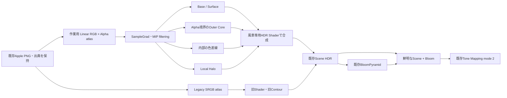

# Neon Windmill：発光源の品質改善と実機比較

実装・測定：2026-10-08。最終資料：2026-10-09。10月15日の制作進捗発表向け。

開始時はcleanな `neta/windmill2`、HEAD `ea3b420be8425ce2357bbeb4baaac13051c5ff76`。同じ作業ブランチ／作業ツリーへ変更を保持し、commit / push / mergeは実施していない。実装と自動検証は完了したが、本人による連続再生・発表画面での最終外観評価は未実施。

## 1. 変更したファイル

| ファイル | 変更 |
| --- | --- |
| project/game/scene/NeonWindmillScene.cpp / .h | 3モード、開発UI、暖色反射、比較・連番・GPU計測・metadata |
| project/game/render/WindmillEmojiRenderer.cpp / .h | 専用quality PSO／64byte設定、premultiplied atlas、余白板、Legacy保持 |
| project/resources/shaders/WindmillNeon.PS.hlsl（新規） | 独立した6寄与、Alpha輪郭、色差線、Local Halo、診断 |
| project/tools/prepare_windmill_emoji.py | 元atlasを保持し、作業textureとSHA manifestを追加 |
| project/tools/test_neon_windmill.ps1 | 従来検証にquality／motion／performanceをオプション追加 |
| project/tools/validate_windmill_quality.py（新規） | 実画像・metadata・元素材・GPU・motion照合 |
| project/CG2_testPro.vcxproj / .filters | 新ShaderのIDE登録 |
| docs/neon-windmill-quality.md（新規）、docs/neon-windmill.md、docs/README.md | 処理説明、比較記録、操作案内 |

本編・敵・戦車・ボス・UIのソース、NeonSkinnedと共有Shader、Bloomの標準設定、Motion、Apple出典JSONと原PNGは変更していない。新しい図版・ライブラリの取得なし。作業texture、実機画像、CSV、動画はignored `generated/` に保持する。

## 2. 現状調査と既存技術の再利用

`NeonWindmillScene.cpp/.h`、`NeonWindmillMotion.h`、`WindmillEmojiRenderer.cpp/.h`、`WindmillEmoji.PS.hlsl`、`prepare_windmill_emoji.py`、`neon-windmill.md` を調査した。独立ModuleのScene HDR描画口を使用し、Evaluateで生成した姿勢に5枚のワールドXY板を置く。CameraRight/Upから頂点を作るビルボードではない。

開始HEADの本体はSRGB atlasの通常色×0.95、Alpha cutout .03、通常Alpha blendと深度書込み。外周はPythonで抽出したAlpha閉曲線を `NeonGridRenderer::QueueContourPolygon` へ渡す。幅 .027 world units、Core 2.1、肩1、Halo .4、Halo alpha .11、手はシアン／ピンク／橙／紫。板に対して相対的に太い輪郭と明るい本体が主な改善対象だった。

3D側の `NeonSkinnedRenderer.cpp/.h`、`NeonSkinnedSurface.hlsli`、`NeonSkinnedBody.hlsli`、`NeonSkinnedOutline.PS.hlsl`、`neon-line-art-quality-plan.md` を確認した。既存の暗いBody、知覚的なTexture色差線、LinearData coverage、独立Core/Halo、SDF＋縮小coverage fallback、寄与診断を設計参考にした。顔・髪の専用原稿による改善とSDFの効果は別で、既存比較はcoverageを通常候補としている。Skinning、Hull、Stencil、モデル専用UVマスクは風車へ直接移植しない。

既存TextureManagerのLinearData、MIP生成、SampleGrad、Scene HDR MRT、Trail root signatureとvertex shader、BloomPyramid、Tone Mapping、NeonShowcaseCapture、RuntimeProfilerを再利用した。既存の `summarize_neon_showcase.py` もGPU CSVの集計に使う。

## 3. 新しい板ポリ描画技術

`WindmillNeon.PS.hlsl` と風車専用PSOを追加した。既存Trail root signatureのPixel b0とatlas t0を使い、共有RendererやGlobal Bloomには変更を加えない。

| 寄与 | 処理と独立制御 |
| --- | --- |
| Base Color | 元画像の線形RGB×Alphaを本体倍率で調整。Core部分は減らし、全面を白へ加算しない |
| Outer Core | 画面UV微分による8方向Alpha近傍の最大−最小。名目上の画面pixel幅、HDR強度、色を分離 |
| Inner Lines | 近傍4点の知覚色差 `sqrt(RGB/Alpha)`。閾値・強度を指定し、Alpha境界付近を除外 |
| Surface Emission | 元の色に沿った弱い面発光。Coreと内部線の場所では抑制 |
| Local Halo | 半径1 / .6 / .3の8方向平均と中心Alphaの差を混合。Core coverageを除外 |
| Global Bloom | 既存Quality Bloom。OFFでもShaderのCoreとLocal Haloは残る |

正のCore幅は最低1pixel相当のサンプル半径を確保する。指定幅と実際の可視幅は元AlphaのAAやMIPに依存し、厳密な解析曲線幅ではない。0でCoreを消せる。通常は1.35pxを推奨する。

作業textureはRGBA8のLinearData。RGBを線形化してAlphaを乗算し、通常MIP生成とSampleGradで縮小する。透明RGBを0にして色漏れを防ぐ。最大の連結Alpha領域＋2texelのAA周辺だけを作業画像へ残し、孤立したAlpha点を新しい光源へ変えない。**元Apple PNGとLegacy atlasは保持する**。これは連結性による整理で、目・口・指を意味的に認識する処理ではない。

Atlasは576×576、3×3、tile192、余白16。Quality板は余白分だけ拡張するが、絵文字本体のワールド位置・大きさを維持する。近傍sampleはtile内に制限する。追加textureの理論量はbase 1,327,104 bytes、通常の全10MIP合計約1.69 MiB。実allocator使用量の測定ではない。通常Core/Halo時は最大37 texture samples/fragment、Legacyは1 sample。新経路へ旧外周ポリラインを重ねない。

Qualityはpremultiplied `ONE / INV_SRC_ALPHA`、深度判定ON・深度書込みOFF。部屋の不透明面→部屋線／軌跡→5枚の板の順にし、本体のOpacityで後方の床線を覆い、Haloは背景へ光だけを加える。5枚の分離した板に限定した経路で、交差する透明物体の汎用ソートではない。Legacyは旧描画順とPSOを維持する。

SDFは導入していない。今回の通常距離では元Alphaの連続した外周、画面幅、色と寄与の分離を優先できた。距離データ・再構成・縮小fallbackを増やす必然性は確認されていない。160px素材の限界をSDFだけで解消できるとも扱わない。

## 4. Legacy / Line Art / Hybridの違い

| 設定 | Legacy | Line Art | Hybrid Gold |
| --- | --- | --- | --- |
| 本体 | 元色×.95 | 元色×.035 | 元色×.48 |
| 外周 | 元の多色・world幅 | 白黄色・画面幅1.35px | 同じCore |
| Core色 / 強度 | 元のContour設定 | (1,.88,.48) / 3.2 | 同左 |
| 内部線 閾値 / 強度 | なし | .24 / 1.1 | .24 / .45 |
| Surface | なし | .015 | .08 |
| Halo 色 / 幅 / 強度 | 元のContour設定 | (1,.38,.025) / 4px / .85 | 同左 |
| 手の色 | 4色 | 黄金色に統一 | 黄金色に統一、元の黄色と陰影を保持 |
| 認識アクセント | 元のまま | 最大45%の赤・ピンク混合 | 同左 |

起動既定はLegacyを維持した。MでLegacy→Line Art→Hybrid→Legacyを切り替える。各モードの調整値は切替後も保持する。**モード変更で時刻・カメラ・姿勢を変えない**。

Space / R / B / H / 矢印 / 1 / 2 / 3 / + / - / Escを維持。DevelopmentのF4で6寄与、発光色、Bloom、背景、停止と連続シークを調整できる。golden presetボタンで設定を戻せる。UIがキーボードを使用中はシーンのキー操作を抑止する。PのPNG/JSON保存も維持する。ReleaseにはF4 UIと自動検証を含めない。

`NeonWindmillMotion.h` はHEADから変更していない。Orbit / Approach / Lock / Recognize / Surge / Reset、円軌道の半径1.65、回転と停止、接近、認識時のU+1FAF5/U+1FAEA切替、カメラ式を保持する。色アクセントだけが既存の認識値へ連動する。

床の既存5点光源／Lambert／距離減衰を保持し、QualityではHalo色と発光強度に応じて暖色へ連動する。壁はQualityだけ78セルに分け、同じ5点の小規模な照明近似を加えた。遠い壁の変化は控えめ。GI・鏡面反射やHDR放射量の積分ではなく、共有PBR／光源管理の改修は行っていない。

## 5. 発光源とBloomの接続：発表用の処理説明



`Bloom.cpp/.h`、`BloomPyramid.cpp/.h`、Extract / Downsample / Upsample / Composite / PostEffectCommonを確認した。現在のQuality経路では、元HDR画素の**最大RGB成分**へsoft knee付き閾値を適用してから2×2平均する。5段階の正規化13-tap downsampleとtent upsampleを混合し、最後にgainを一度適用する。元の鮮明なScene光源を残してBloomを合成する。旧Gaussian経路の輝度閾値や係数を現在のQuality経路と混同しない。

Tone Mappingは既存mode 2の共有shoulderでRGB比率を保つ。風車のShowcase設定はPostDrawの一時上書きとRAII復元により局所適用される。

全モードの既定Bloom・露出は同一：threshold .8、soft knee .5、scatter .65、radius 1、gain .65、exposure .85、tone mode 2。**Global Bloomの標準値は変更していない**。三モードの総HDRエネルギーを正規化した実験ではないが、Bloom gain増加だけを改善根拠にしていない。

## 6. 実機画像と動画の比較結果

NVIDIA GeForce RTX 4060 Laptop GPU、DirectX 12、Development x64、1280×720。各セットの時刻・camera・angle・center・recognition・visibility・露出・Bloom threshold/gain・TAA OFFをJSONで照合した。

| 条件 | 固定時刻 | ファイル名の先頭 |
| --- | ---: | --- |
| 回転中 | 3.35s | orbit |
| 接近中 | 10.5s | approach |
| 認識直前 | 13.3s | before |
| 認識直後 | 13.95s | after |
| 急接近中 | 14.65s | surge |

`generated/neon_windmill_quality/comparison/` に48枚の**未加工バックバッファPNG＋JSON**を保存した。各条件は `_0` Legacy、`_1` Line Art、`_2` Hybridと `_off` / `_on` の6枚。追加18枚は背景OFFでBase / Outer Core / Inner / Halo / Surface、幅・ゼロ強度・側面・遠距離の診断。previewはラベル付き縮小表示で、pixel比較は元1280×720 PNGを使う。

- HEADの `orbit_off / orbit_on / lock_on / recognized_on` と新Legacyの対応4枚は全RGB画素一致。説明ラベルには新操作を追加した。
- Alpha輪郭は指の凹凸へ追従し、Hybridは認識後の黒い瞳と指の陰影を残す。Line Artでは目・笑顔の色差境界が見える。意味的な必要線の抽出ではない。
- 最初のQuality画像で床線が手へ重なる問題と孤立した光点を発見し、描画順と作業Alphaを修正した。修正前43枚は `iteration1/` に保持した。
- Core単独画像はHaloの幅4→6、Halo強度0でも全画素一致。Halo調整がCore sourceを変えないことを確認した。
- Bloom gain 0とBloom OFFの同条件合成画像は全画素一致。Bloom OFFでもCoreが残る。Local Haloを消すにはHalo強度を別に0へする。
- Base、Core、Inner、Halo、Surface単独画像はそれぞれ非ゼロ。Core幅、Halo幅・強度、Base倍率、全発光0の変更も実機出力へ反映された。
- 視点yaw .72、距離19も採取。縮小時は表情を読めるが、手の薄い模様は弱くなる。


[Legacy原寸](../generated/neon_windmill_quality/comparison/before_0_on.png) / [Line Art原寸](../generated/neon_windmill_quality/comparison/before_1_on.png) / [Hybrid原寸](../generated/neon_windmill_quality/comparison/before_2_on.png) / [Core診断](../generated/neon_windmill_quality/comparison/diagnostic_core.png) / [Halo診断](../generated/neon_windmill_quality/comparison/diagnostic_halo.png)。

`motion/` は元のEvaluateを固定1/30秒刻みで実行した480枚のDX12 PNGとframe JSON。0～15.9667秒、全6Phaseを含む。`hybrid_motion.mp4` は既存ffmpegで符号化した30fps、16秒、H.264 CRF16 / yuv420p。発光の後加工・補間はない。リアルタイム録画のフレームペーシング実測ではなく、実姿勢のエンジン連番である。MP4は圧縮・色変換を含むので一致検査にはPNGを使う。

[16秒のHybrid動画](../generated/neon_windmill_quality/motion/hybrid_motion.mp4)。8つの代表raw frameを画像確認し、大きな輪郭欠損・床線透過・光点の再発は見えなかった。Orbitの195frameでは、投影した顔ROIのRGB8輝度proxyの変動係数約.33%、連続frame差のP95約1.02%、最大約1.26%。元色、Bloom、投影変化、閾値を含む限定的なproxyで、知覚的ちらつきの合否指標ではない。詳細は `motion_review.json/.png`。

**本人による連続再生の外観評価とF4スライダー操作は未実施**。自動PASSや代表静止画だけで発表用の最終外観が承認済みとはしない。

## 7. 性能測定

既存RuntimeProfilerのD3D12 timestampを再利用。Fence完了後のtick差、queue frequency 1,000,000,000 Hz、各条件60frame warmup＋300有効frame。Debug Layer ON、GPU-based validation OFF、3.35秒で停止、camera/Bloom/露出固定。フレーム制限OFF。温度・クロック・電源は厳密に統制していない。

最初のLegacy runに大きな変動があったため、順序2→0→1、1→2→0の2セットも採取し、元runを保持した。以下は**3runの平均値の中央値／各run P95の中央値**。P95はnearest rank。元CSV／reportと集計は `perf0～2/`、`perf-repeat/`、`performance_summary.json`。

| Mode | Windmill Scene 平均 / P95 ms | Plates 平均 ms | GPU frame 平均 / P95 ms |
| --- | ---: | ---: | ---: |
| Legacy | .207729 / .208896 | .001894 | .393533 / .394240 |
| Line Art | .234083 / .237568 | .029303 | .419604 / .423936 |
| Hybrid | .234602 / .237568 | .029276 | .420106 / .423936 |

Sceneは部屋・壁・板・線を含む親scope、GPU frameはさらにBloom等を含む。合算しない。Legacy平均のrun範囲は.207705～.269520ms、最初のP95は.442368msだった。安定した一値だけを性能保証に使わない。新Shaderの多点sampleと壁近似を含む総Scene差は中央値で約+.027ms。この条件で大きな負荷増は見られないが、Release、全距離・解像度、弱いGPUへ外挿しない。

停止条件の頂点数はLegacy 76,296、Quality 59,454（各3回の3D draw）。Qualityは外周ポリラインを省き、壁面2,772頂点を追加しても総数が減る。診断の背景OFFは1 draw。板は最大5枚、0 visibilityのResetでは省略する。

## 8. ビルド・関連テスト・保全

| 項目 | 結果 |
| --- | --- |
| 最終Development / Release x64 | PASS、VS18 / v145、両方0 warning / 0 error |
| 専用CPU軌道テスト | PASS、3,201姿勢、円軌道・XY固定・対称・停止角・各境界・認識・Reset・負時刻・非有限値 |
| 既存6枚の風車GPU test | PASS、Legacy、同姿勢Bloom、側面、停止、認識 |
| quality実機validator | PASS、48枚、同条件比較、独立寄与・幅・zero、Legacy pixel parity、source SHA／premultiplied値 |
| 連番／GPU timestamp | PASS、480frame・全6Phase、各run300有効GPU frame×3mode×3run |
| 既存Bloom pipeline Hardware | PASS、HDR readback、MRT/CB、抽出・filter・gain・sharp source・Tone Mapping |
| 既存NeonSkinned pipeline Hardware | PASS、Coverage/SDF、Core/Halo/Body、Alpha/Depth/Stencil、複数Draw・fallback等 |
| Developer build profile | PASS、5設定組合せ、exe/profile SHA、Releaseで開発機能OFF |
| Release通常ゲーム smoke | PASS、通常Title→Expedition、無効scenario環境を消費せず、Developer/UI/profiler OFF |
| Release風車 startup | PASS、新Shader/texture/PSOを初期化しfirst_frame.NEON_WINDMILL、Developer/UI/profiler OFF |
| 共通inventory | **既存由来FAIL**：test_neon_contour_geometry.ps1が未分類。共通全スイート未実施 |
| 人間の最終外観／操作確認 | **未実施**。本人の動画再生・F4調整・発表画面での確認が必要 |

途中のDevelopmentコンパイルで診断用dxポインターのconst指定が不適切だったが修正した。重複起動した中間ビルドのPDB競合も最終の逐次ビルドでは解消。最終製品の残エラーや既存由来FAILと混同しない。

ログは `generated/neon_windmill_quality/` の build-development / build-release / quality-tests / bloom-regression / skinned-regression / developer-profile / release-game-smoke / inventory。共通inventoryの問題を風車変更に混ぜて修正していない。

元Apple出典JSONと原PNG、元モデル／専用線原稿、既存アニメーションとGlobal Bloom標準値を保全。offline生成は既存Pillow/NumPy、動画は既存ffmpeg。元素材の削除・置換・外部公開はしていない。HEAD比較画像と初期Quality画像は別ディレクトリへ保持し、新テストの出力は再実行時に更新する。

## 9. 残る見た目の問題と検証範囲

内部線は色差の近似なので、口の二つの境界や頬の陰影など必要以上の線も出る。手の薄いしわは閾値で落ちる。Hybridは弱めの内部発光で元の模様を保持する方を優先した。顔内部線には小さなpixel段差が残り、回転する手の微細なちらつきは全480frameの連続した人間評価をしていない。

元素材160px、RGBA8線形化の量子化、極端な側面／縮小、有限のatlas余白が限界。風車のRaw FP16 readbackによる白飛び・HDRエネルギー測定は未実施で、最終RGB8画像と既存BloomのGPU数値testを区別する。

再現手順：

```powershell
# 既にあるApple入力PNGから作業textureを生成。外部素材を取得しない。
python project/tools/prepare_windmill_emoji.py
# Development x64をビルド後、Pillow/NumPyのあるPythonを指定
project/tools/test_neon_windmill.ps1 -Quality -RecordMotion -MeasureGpu -PythonPath python
# 480枚の未加工PNGから16秒の動画を符号化
ffmpeg -framerate 30 -i generated/neon_windmill_quality/motion/frame_%04d.png -c:v libx264 -crf 16 -pix_fmt yuv420p generated/neon_windmill_quality/motion/hybrid_motion.mp4
```

既存ラッパーの `-CpuOnly` は従来どおり素材・GPU不要。全実機比較はDevelopmentを使用し、Releaseは自動キャプチャ環境を消費しない。比較JSONの `appearance` はquality用設定でLegacyでは未使用。Legacyの実値は§2と保持したHEAD実装を参照する。

## 10. 推奨プリセットと発表の説明例

**Hybrid Goldを推奨**する。元の黄色、歯、黒い瞳、指の陰影を読み取れ、Bloom OFFでも細い光源があり、ONでは輪郭を中心に光が広がる。Line Artは処理の説明と比較に向くが、手の弱い模様は抽出しにくい。発表は停止状態でM/B比較→16秒の連続演出という順が説明しやすい。数値は物理単位ではなく、この1280×720表示の候補であり、最終的には発表先の画面で調整する。

説明例：「自作DirectX 12エンジンの3Dネオン研究で使ったCore・Halo・本体の分離を、絵文字の板ポリに適用しました。透明境界から細い光源を作り、色差による内部線と通常色を別に制御しています。Bloomを切っても芯が見え、同じ姿勢でLegacy／Line Art／Hybridを比較できます。絵文字図版はApple、軌道と発光Shader・比較機能は自分の実装です。」新しい研究アルゴリズムの発明や意味的な顔解析として紹介しない。
