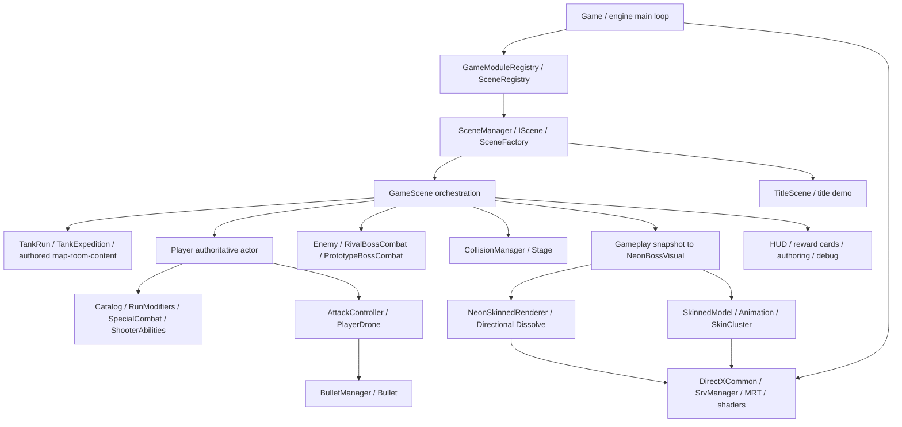

# Architecture baseline

開始: 2026-10-05 (Asia/Tokyo)。この記録は現在の作業treeを基準にする。以前のチャットのbranchや未commit状態は引き継がない。

## 開始状態

- branch: `refactor/engine`
- HEAD: `5b531d6eb3f2437ad8ab552f47f512ee8e1febd2`
- staged / unstaged / untracked: いずれもなし。
- tracked files: 926。C++ source: 173、header: 288。`project/externals/`を除くsource: 145、header: 142。
- 物理行数（空行も含む）: GameScene.cpp 7,126、Player.cpp 5,029、Enemy.cpp 1,608。
- local VS: VS2022 17.14.13 / VS18 18.9.3。project default v145。Development / Release x64が対象。solutionのDebugはDevelopmentに割当。
- 適用されるAGENTS.mdはroot・祖先・対象sourceに見つからなかった。

詳細なfile count / 大きいfile上位 / 開始statusは`generated/repository-engineering-overhaul/baseline/repository-state.json`、全tracked file一覧は同directoryの`tracked-files.txt`。行数は判断の補助であり、悪い設計という判定には使わない。

既存GitHub Actionsは`DevelopmentBuild.yml`、`ReleaseBuild.yml`、`DebugBuild.yml`、`CheckUnwantedFiles.yml`の4本。buildはmasterへのpush、windows-2022、setup-msbuild、既存dependency bootstrap、x64／v143を使う。DebugはsolutionでDevelopmentに割り当てられる。不要file workflowはubuntu-latestでname／directory patternを監査し、手動dispatchもある。今回workflowとbootstrapを変更せず、remote CIの新規実行も行わない。localでは既存v145で両configurationを実buildし、不要file policyを現在のtracked／untracked sourceへ適用する。remote v143 jobの成功はlocal v145のPASSと混同しない。

## 現在の境界と依存

GameModuleBootstrap / BuiltInGameModuleがscene登録を担い、SceneFactoryは名前から作るだけ。SceneManagerはfactory/currentSceneをunique_ptrで所有し、factoryがnullptrを返す生成失敗では現在のsceneを維持する。生成成功時は旧Sceneを破棄してから新SceneのInitializeを呼ぶため、Initialize例外までrollbackするtransactionではない。Finalizeはengine managerの破棄前にsceneを破棄する。Gameのframe末尾は既存fenceを待ち、次Updateでscene・GPU resourceを解放する現在の順序は安全。並列frameへ変更する場合にはこの前提を再設計する必要がある。

GameSceneはPlayer / Enemy / EnemyManager / BulletManager / Stage / VisualとUIを所有し、更新順を決める。衝突中の発射はBulletManagerへ予約し、走査後に反映する。PlayerとEnemyの位置・HP・攻撃時計がauthoritative。NeonBossVisualは値入力だけを受け、Enemy/Combatへ戻る参照やcallbackを持たない。

engine側のBloom.h / Shadow.hにはSceneManager.hのincludeがあり、Sceneの共通情報をengineのpost effectが読む逆方向のcouplingも存在する。今回のactor/component抽出でこの依存をさらに増やさない。Project全体のengine/game境界を全面移動する変更は、実際のcall siteとbuildに広く影響するため、このGoalでは観測・記録と必要範囲の改善に限定する。

Playerはbody Object3d・Input・Stage・BulletManagerを借用し、自身のdrone・barrel・UI・event queuesを所有する。StageはColliderを通じてaxisごとに位置を解決する。複数のsingleton（Object3dCommon / Input / Audio / TextureManager / ParticleManager等）への依存が残るが、純粋な計算componentへその依存を移す必要はない。

## 既に分離されている責務

- GameSceneにはTankRun / TankExpedition / ExpeditionMap / ExpeditionBuild / Balance / Authoring / TitleDemo / 各実機Validationのtranslation unitがある。ただし同じ巨大classのmemberへ直接アクセスするため、独立componentになったとは限らない。再度同じ責務をfileへ移すだけの変更はしない。
- PlayerClassCatalogは設定のtransactional loadとlookupを持つ。Player.SpecialAbilities.cpp / Player.EvolutionUi.cpp / Player.ClassEditor.cpp、PlayerUiHelpersと既存RunModifiers / SpecialCombat / Loadoutは維持する。
- EnemyのRival / Prototype combat時計は既に値ベースの独立policy。3Dのclip都合で時計・残弾・Dash・HP閾値を変更しない。
- NeonBossVisualStateとNeonBossVisual、NeonCharacterStyle、既存Preview生成clip、NeonShowcaseCaptureは前回統合済み。新たにrendererやcaptureを作らず利用する。

## 残る高結合責務と今回の抽出候補

| 現在の責務 | call site / 所有 | 今回の判断 |
| --- | --- | --- |
| 戦闘の死亡優先順位・撃破/結果timer | GameScene::UpdateGameplayEventEffects / BeginBossDefeatSequence / BeginGameOver / UpdateGameFlow | 音・UI・currency回収の実行はsceneに残し、death arbitration / timer / 一度だけのimpact・結果ready通知を値componentへ抽出する |
| Boss gameplayからVisualへの行動mappingと短い表示保持 | GameScene.NeonBoss.cppのUpdateNeonBossVisual、遭遇世代・前回shot/positionをsceneが持つ | raw gameplay snapshotを受ける小さいbridgeへmapping/履歴を移し、rendererへの逆依存を作らない |
| Player派生stats | RecalculateStatsFromBase、base / class profile / level / run tuning / maintenance | 算術順序を保つ小さい入力/出力componentへ。actorのHP適用とcollision damage反映はadapterに残す |
| Player移動のinertia / dtからsubstep計算 | Player::Update、StageへX then Yの衝突解決 | 移動計算だけを純粋componentへ。InputとStageはactor側に残す |
| Developer検証fixtureの状態・snapshot・capturing | 既存Combat/Special/Experience/Neon検証がそれぞれscene memberを持つ | 既存機能は維持し、共通fixed seed/timestep/scripted inputと終了invariantを持つScenario Runnerを追加。実体操作は小さいscene adapterに限定 |

GameSceneの初期化・描画・UI、PlayerのHUDは大きいが、いきなり全ownershipを移すとGPU/actor/入力の契約まで広がる。今回の最初の抽出は、独立性とテスト可能性が高い上表の境界から行う。

## correctnessとdeterminismの注意点

高信頼度の候補は実adapterまたは実機で再現してから修正する。Previewのinstance descriptor返却漏れとDroneの致死衝突後に次Updateで行動を先に行う順序を再現し、所有側teardownと即時死亡の限定修正を行った。根拠・実行証拠は [correctness-audit.md](correctness-audit.md)、確証のない問題は [potential-issues.md](potential-issues.md)へ分ける。

cg2::RandはCalculation.cppのglobal mt19937を共有し、Gameplay・particle・camera shakeが同じstreamを消費する。Scenarioはseedをscene/fixture初期化前に指定し、同じ更新・描画・capture経路で再現性を確認する。今回、既存通常プレイの乱数streamを勝手に分けてbalanceを変えない。GPU timestampやwall timeは決定的state比較から除外する。

GameSceneの基準時間は既に1/60秒。combatはscreen effect multiplier / hit holdで減速し、menu/evolution/resultで停止する。Scenarioはfixed基準時間を明示し、既存combat時間倍率とdeath presentationの分離を保つ。

## Gameplay以外の実call site監査

以下はactorの抽出対象以外も読むために、実際の入口・資源所有・更新契約を確認した記録である。全sourceのfile countを監査済み範囲と同一視しない。

| 領域・確認したfile | 具体的な境界・観測 | 今回の判断 |
|---|---|---|
| UI: `TankRewardCard.h/.cpp`、`TankRewardCardDemo.h`、`TankRewardPreviewRenderer.h/.cpp`、`GameScene.ExpeditionBuild.cpp` | Sceneがcatalog／現在buildを値のcard modelへ変換する。equal modelのSetModelはtextとdemo clockを再構築しない。previewは実Playerを生成せず、独立DemoSnapshotを描く。512×176のprivate rendererは4 RT・vertex／trail buffer・自身のRTV heapを所有し、back bufferへ戻る際にRTV／DSV／viewport／scissorを復元する。 | Actorと表示の双方向依存を増やさず維持する。毎frame model値を設定するだけでModel loaderが呼ばれる構造ではない。既存reward-card／presentation／trailテストと実機で検証する。 |
| HUD文字: `NeonTextEffect.h/.cpp`、`TextLabel.cpp`、`TextRenderer.cpp`、`TextureManager.cpp` | TextLabelは同一text／styleなら再生成を避け、TextRendererのtext＋style cache pathでPNGを再利用する。NeonTextEffectは渡されたlive label一覧に対してglow Spriteの外観を同期し、2つのObjectPostEffectを所有する。textureは共有managerの寿命で保持する。 | label pointerは索引用の借用であり、Gameplay stateではない。Text生成／cache hitは既存profileで測れる。cache保有数をinstance resource漏れと混同せず、計測根拠なしのcache／UI全面変更を行わない。 |
| 制作Editor: `ExpeditionMapEditor`／`ExpeditionRoomEditor`／`ExpeditionContentEditor`各h/cpp、`GameScene.ExpeditionMap.cpp` | editorはdraftを保持し、Apply／Save／Reloadが検証成功した場合だけlive定義を置換する。Roomは編集mapと実行中map双方との整合性を検査する。Mapの定義更新は実行中MapRunの所持金／訪問pathを消さず、次runへ反映する。Contentは使用中enemy IDを検査し、Sceneが変更catalogをactor側へ注入する。 | 既存runtime-authoring契約を維持する。file分割済みeditorを新class名へ移すだけの改修を行わない。active actorのresetはSceneが決める。 |
| 設定保存・読み込み: `TankExpeditionContent.h`／`TankExpeditionRooms.h`／`TankExpeditionMap.h`／`TankExpeditionBalance.h`、`GameScene.Authoring.cpp`／`GameScene.Balance.cpp`、`PlayerClassCatalog.cpp`／`Player.ClassEditor.cpp` | Content／Room／Mapはcandidate検証後に出力を置換し、保存はtemporaryを作ってWindowsのMoveFileExWで置換する。Room inputは8 MiB上限がある。Player classのloadはcatalog全体をtry/catchで扱い、editorはreload後にselection pointerを取得し直す。Balanceはsanitize後に適用し、通常applyは失われたHP／staminaを回復しない。 | 一覧全体のloadが途中で壊れるという疑いは既存transactional実装により否定した。postとvisualの2file保存は個別置換であり、bundle全体のtransactionは保証しない。現行call siteでの再現がない非有限configはpotentialへ残す。 |
| Developer／authoring guard: `DeveloperTools.h`、`GameScene.Authoring.cpp`、`Player.ClassEditor.cpp`、`NeonSkinnedPreview.h/.cpp` | DeveloperToolsはNDEBUG時に安全な既定0。Preview／Neon入口／新ScenarioはCG2_DEVELOPER_TOOLSかつ!NDEBUG。既存editorにはUSE_IMGUIまたはUSE_RUNTIME_PROFILERのguardもあり、通常Release profileはこれらのUIを含まない。既存Release実機autotest envはUIとは別契約。 | 新Runnerはstrict guardを用いる。既存authoring入口を今回の都合で通常UIへ追加しない。Release非露出はprofile／実binary／package確認で別途確定する。 |
| Engine資源: `DirectXCommon.cpp`、`SkinCluster.cpp`、`RenderTexture.cpp`、`ObjectPostEffect.cpp`、`SrvManager`、`Game.cpp::Finalize` | Frame末Fence後に次Updateが走る。palette SRVとNeon maskは明示release、RTはowner destructionでSRV返却。Sceneを先に終了し、共有managerを後で終了する。Sprite／RT／Previewのownerと共有texture／model cacheを区別した。 | 一律の暗黙RAIIへ変更せず、実際にreleaseを失ったPreview ownerだけを修正する。複数frame in flightの導入は別の全call-site監査が必要。 |
| Shader／pipeline: `ShaderDiskCache.h`、`DirectXCommon::CompileShader`、`NeonSkinned*.hlsl/.hlsli`、`NeonDissolve.hlsli` | process内memory cacheはpath＋profile、disk DXIL cacheはsource・profile・compile引数・include内容を検査する。disk側は見つからないinclude候補も記録し、cache失敗は通常DXC compileへ戻る。Skinning／Dissolve CPU-HLSL契約と終端は既存focused suite対象。 | shader、pipeline、品質設定、通常Bloomは今回変更しない。実行中のshader hot-reloadを保証するcacheではない。shader欠落のlegacy assertはpackage検証とpotentialに分ける。 |
| Build／tools: `CG2_testPro.vcxproj`／filters、`test_*.ps1`／Python fixture tools、`TankSubmissionPackage.ps1` | isolated compile、production method adapter、GPU pipeline、実機walkthrough、画像比較は異なる証拠を持つ。build登録は既存profileを保ち、resource依存とpackageは専用検証で扱う。古いfreeze guardのexact-textテストは現行の2flag guardへ意味を合わせ、欠落／誤AND／return順序のnegative fixtureを追加した。 | unit PASSだけで実機・視覚品質・Release packagingを代替しない。新Sessionは実JSON／Unicode path／scene epochを孤立検証し、Scenario adapterの実actor／GPU確認は別に行う。全testの実行・historical baseline failureはvalidation ledgerで追う。 |

この監査ではUI／editor／rendererの全面改修を必要とする再現済み不具合は追加発見していない。engine→SceneManager、singleton借用、Sceneの多い設定memberは意図的に残す結合であり、読み終わっただけで解消したとは報告しない。通常dt前提・one-shot Initialize・legacy loader・非有限configの未確証事項はpotential文書、測定から選ぶ改善はperformance文書で追う。

## 実施順と検証gate

1. 全関連baseline test、Development / Release build、package、既存実機probe、測定証拠を保存する。
2. 小さいGameScene componentを1つずつ抽出し、isolated test → build → gameplay regression。
3. Playerの2責務を同様に抽出する。既存Catalog/Run政策の重複は作らない。
4. 根拠のあるcorrectness修正とdeath/resource regression。
5. Developer Scenario Runnerとobservable snapshot、代表scenario・再現性・invariant。
6. 代表状態の複数frame性能/画像を測り、上位bottleneckだけ同条件Before/Afterで判断。
7. 全test/build/package/Release startupとDeveloper除外の再監査、全差分レビュー、要求別completion audit。

テスト・計測の結果は後続文書へ記録し、未完了phaseをこのbaseline文書で完了したとは扱わない。commit / push / merge / reset / cleanや外部downloadは行わない。
