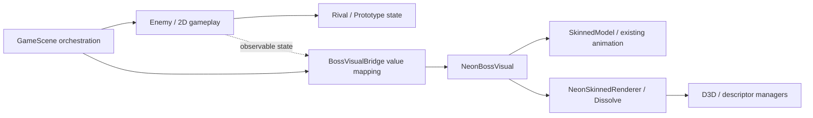

# Correctness / lifetime監査

開始点は `refactor/engine` / `5b531d6eb3f2437ad8ab552f47f512ee8e1febd2`、開始statusはclean。完成済みNeon Boss統合を含む現在の実装を基準に調べた。ファイルサイズや疑わしい記述だけでは修正せず、実行した再現または明確な所有権違反を根拠とした。

## 確認された不具合

| ID | 現象・根拠 | 対応・検証 |
|---|---|---|
| C1 | Developer Neon Previewの破棄時、palette SRVとfallback-mask SRVを解放していなかった。実際の旧destructor本文を実行するadapterで破棄後に2 / 2件が残る。Load途中失敗後の再試行も、旧モデル・rendererのdescriptorを失う経路がある。 | 所有側のprivate `ReleaseResources()`をdestructorとLoad外側catchから呼ぶ。実際の新しいowner本文を使うC++20 /W4 /WXテストがPASS。未初期化、通常破棄、モデルのみ／rendererまでの部分失敗、同一ownerでのretry、二重release、100回再生成、共有texture cache維持を検証。 |
| C2 | Droneの致死接触でHP0になっても死亡を確定せず、次Updateで移動・射撃・地形処理を先に行っていた。実際の旧production本文の再現結果は `hp=0 diedImmediately=0 shotsAfterLethal=1 collisionCallsAfterLethal=2 movementAfterLethal=0.235362`。 | OnCollisionで致死を即時確定し、死亡後のUpdate／Attack／Damage／接触を拒否する。実production本文の修正後は `hp=0 diedImmediately=1 shotsAfterLethal=0 collisionCallsAfterLethal=0 movementAfterLethal=0`。通常・同位置接触、反復致死、非致死1HP、資源接触、living-bomb再構築完了frameをfocused suiteで検証した。 |
| C3 | 既存entry pointがWM_QUITの終了statusを捨てていた。新Runnerのunknown_room probeはframe0の正しいfailure reportと `PostQuitMessage(9)` に到達したが、実processはexit0。Game::MainLoopはmessageのwParamを使わず、Runはvoid、WinMainは常に0を返していた。 | MainLoop／Runが終了codeを返し、WinMainはFinalize／traceを終えてからそのcodeを返す。WM_QUITを取得した時点でinner message loopを止め、後続messageによる上書きも避ける。実差分と唯一のRun call siteを独立review済み。修正後の5つのScene／終了条件negative probeと2つのconstructor negativeは、実process exit9／bounded reportをPASSした。 |

C1の根拠は `generated/repository-engineering-overhaul/preview-owner-baseline-proof.log`、実装後は `neon-preview-lifecycle-implementation.log`。所有権・GPU完了境界・retryの自己レビュー後にも同じproduction本文で再実行し、`neon-preview-lifecycle-self-review.log`でPASSを確認した。C2の再現は同ディレクトリの `drone-lifecycle-baseline-reproduction.log`。adapterの仮resourceは、engineと同じく明示releaseまでdescriptorを保持する。GPU resourceそのものの解放は既存palette／Neon rendering pipelineテストが別途実行しており、ownerテストだけでD3D全体の正常性を主張しない。

C2の修正後の実測は `drone-lifecycle-after-fix-observation.log`、永久回帰suiteは `player-drone-stage3-tests.log`。致死後の行動停止だけでなく、既存の非致死knockbackとliving-bombの5.5秒再構築を保持する。Player担当はprojectile／collision／追加ability suiteもPASSを確認した。solution全体のbuild・runtime結果は最終検証報告で別途扱う。

C3の再現は `generated/repository-engineering-overhaul/post-repair/probes/run_20261004_224057_706_e536dff2/configuration_unknown_room/report.json` と同runのwrapper失敗結果。reportは `completed=false`、`frameCount=0`、存在しないroomの初期化errorとduration未達を記録し、Session／adapter側の拒否は成立していた。parserやwrapperのassertを弱める修正ではない。同じ既存entry pointはCombat／Experience／Map／Title／Neonなどの非0 validation codeも捨てる構造だったが、それらの失敗runtimeを別途再現したとは主張しない。今回の実process再現と旧MainLoop／WinMain本文が、status伝播欠落の根拠である。

C3修正後の実機証拠は `final-entry-validation/scenario-entry-regressions.log` と `final-entry-validation/scenarios/run_20261004_224906_970_e80d8442/suite.json`。unknown room／unknown upgrade／不適合room／wrong startupは0 frameでexit9、短いBossDeathは120 frameの構造的完了未達でexit9を返した。同suiteのcustom入力・HP・room・wave・Repair・1/120 dtとrestart capture境界はexit0でPASS。`final-entry-validation/results.json` のconstructor-malformed／constructor-nonexistentも、enabled=falseになる早期Session失敗を0 frame／exit9で検証した。正常時と失敗時のstatusを実processで確認しており、assertの緩和は行っていない。

C1にはDeveloper専用 `NeonSkinnedPreview::ValidateResourceLifecycle(camera, debugCamera, repeats)` も加えた。共有textureを一度warm-upし、その後の実際のD3D Preview再生成で「ロード中はbaseline + 2、破棄後はbaseline」を各回確認する。通常UIやkeyboard hookは追加せず、Scenario adapterから呼ぶ。

初回の実D3D `preview_lifecycle` は240 frameで完了し、3回すべての再生成・破棄がPASSした。descriptorは初期317、共有texture warm-up後321、ロード中最大323、破棄後321で、errorは空。証拠は `generated/repository-engineering-overhaul/scenarios-first-pass/run_20261004_214441_244_365c5600/preview_lifecycle_1/report.json` の `details.previewLifecycle`。これはowner adapterを実資源で補う初回の証拠であり、最終source freeze後の反復suiteとは区別する。

終了code伝播修正前のfreeze候補binaryの `final-validation/artifacts/test_gameplay_scenarios/run_20261004_221102_241_e67a04a2/preview_lifecycle_1/report.json` と `preview_lifecycle_2/report.json` は、それぞれ240 frame、`completed=true`、`errors=[]`。各processで3回、計6回の実D3D再生成・破棄が完了し、両processとも初期317 → cache baseline321 → loaded最大323 → teardown321、`baselineStable=true`を記録した。同じdriverの `test_neon_preview_lifecycle.log` は、production owner本文による未初期化、部分失敗／retry、二重release、100回再生成もPASSした。C3でPreview／renderer本文は変更しない。

## 所有権と状態遷移の確認

| 対象 | 確認した契約・call site | 結果・検証範囲 |
|---|---|---|
| Enemy死亡 | `TakeDamage`／`OnCollision`で致死を即時確定。DieはHP・半径・移動／衝撃速度・Dash距離を0へ戻し、Fire／Move／捕食／資源取得が死亡後を拒否する。 | `boss_gameplay_lifecycle_tests`は実production本文でUINT32_MAX、HP0、死亡後の移動／発射／報酬拒否、Reset generationを検証する。 |
| Rival / Prototype | state機構は時刻・照準・発射要求のみを持つ。描画、弾生成、移動、経路、衝突はEnemyが担当。有限の正dtだけを使い、長いStepは0.10秒まで。 | 既存combatテストが予告、固定照準、弾倉、再装填、HP段階、stall／invalid dtを検証する。 |
| Gameplay → Neon | Enemyのvalue snapshotをBridgeで行動・短い攻撃表示履歴へ写す。Visualはvalue入力で、Enemy pointerやGameplay callbackを持たない。 | 同じclipのTelegraph／Attack、Dash姿勢、死亡latch、Dissolve進行、明示Reset以外で復活しない契約を保つ。 |
| Neon死亡 | paletteは最後の生存姿勢を保持。既存Directional Dissolveが完了したUpdate境界で2件のinstance SRVを解放する。 | 純粋stateテスト、実palette／GPU pipelineテスト、実機captureを併用した。最新の終端画像で通常体への戻りや人型／Outline残像がないことを別途確認した。 |
| Neon shader終端 | Body／Geometry共有PSとOutline PSは同じmodel-space Dissolve評価を使い、微分をalpha／Dissolve clipより先に計算する。progress=1は負のsigned distanceと発光0を返す。 | 既存CPU referenceとGPU pipelineテストがC++／HLSL定数のoffset・型、固定seed、0／中間／1の色・depth／outline終端を検証する。shader／pipeline自体は今回変更しない。 |
| Projectile所有権 | BulletManagerはunique_ptrで実体を所有。衝突中は生成を予約し、全ペア／親走査後に追加する。死弾は後のUpdate境界で消す。 | vector再配置で走査を壊さない。所有者別上限、分裂予約の一度消費、非再帰分裂、反射、命中履歴を既存production adapterが検証する。 |
| Trail借用 | BulletはTrailManager実体と設定を借用。ClearAllは弾のtrailをdetachしてからTrail実体を消し、戦闘の借用pointerもnullへ戻す。 | 部屋移動で前のPlayer／Boss／EnemyManager／Stageを次Updateが参照しない。 |
| Collision走査 | collider一覧を更新後に作り直す。各pairの入口で死弾／死敵を拒否し、成立したpairは両者へ通知する。 | 先の通知で弾が死んでも相手のダメージ通知を失わない。後続pairでの重複命中を拒否する。実体削除をpair loopへ持ち込まない。 |
| 通常Enemy / Summon | EnemyManagerは走査後に召喚要求を取り込み、親はunique_ptr実体の安定アドレス／collision IDで扱う。孤立召喚をIDで破棄する。 | 指揮官pointerはvector再配置で実体移動しない。撃破callback前に死亡確定し、重複報酬・再入を防ぐ。 |
| Scene callback | GameScene destructorがExpEnemyのstatic撃破callbackをnullへ戻す。SceneManagerは旧Sceneを置換・破棄してから新SceneのInitializeを呼ぶ。 | 前Sceneをcaptureした関数が次Sceneへ残らず、旧destructorが新Sceneの登録済みcallbackを消す順序にもならない。retryの境界を実call siteで確認した。 |
| 部屋／Stage切替 | authored roomは地形の書き込み・検証を終えてから旧actorを消す。Stage::LoadRunMapは全CSVを作業領域で検証してから置換し、旧blockを消して生成する。 | 壊れたCSV／missing resourceで途中までの地形を採用しない。部屋のborrowed pointer消去は衝突中に行わない。 |
| Resultフロー | 遠征で同時死亡した場合はPlayer death、旧通常モードではBoss defeatを優先する。撃破時計0のframeも既存通りpresentation分岐でreturnする。 | CombatFlowController抽出はこの順序・impact遅延・通貨回収待ちを保持する。専用純粋テストとgameplay回帰を併用する。 |
| GPU frame境界 | DirectXCommon::PostDrawはFence完了を待ってから次Updateへ進む。Scene切替・instance解放・CB再利用はその境界で行う。 | 今回は複数frame in flightへの変更を行わない。この契約を変えるときはすべてのcallerの寿命を再設計する必要がある。 |
| shutdown | Game::FinalizeはGPUを待ち、SrvManagerが生存中にSceneManagerをFinalizeし、texture／model cacheを後で終了する。 | static destruction順序にScene resourceの正常性を依存させない。 |
| RenderTexture | color／depth SRVをdestructorで返す。再生成されるObjectPostEffect／BloomPyramidは自身のRTV heapを所有する。 | Sceneの繰り返しで以前のeffectのRTV indexを同じheapへ積み上げる構造ではない。 |
| animation pointer | RegisterAnimationsはkey／joint／quaternionを検証してからvectorをswapし、AnimationPlayerの参照を再接続する。 | appendによるdangling clip pointerを作らない。missing animationはBindPose、Neonは共有生成Idle／Attackを明示登録する。 |
| Release guard | Default ReleaseはNDEBUG、CG2_DEVELOPER_TOOLS=0、USE_IMGUIなし。Preview／Neon Developer／新RunnerはCG2_DEVELOPER_TOOLSかつ!NDEBUGで囲む。 | 最終Release binaryは存在しない／不正JSONのScenario envを無視し、通常Title→Expeditionへ進む。Developer／UI／profilerはすべてOFF。binary smokeはPASS、package全体の結果は最終検証報告で扱う。 |

## 依存と責務

RendererからGameplay判断への逆依存は追加しない。Enemyは現状でもAI・navigation・HP・攻撃要求・2D表示を持つが、Pure combat stateと独立Visualがすでに分かれている。全面的なEnemy書き換えより、Scene側のpresentation mapping履歴をvalue-only Bridgeへ移す境界が自然で、孤立テストもできる。

2回目の抽出では `GameScene::UpdateNeonBossVisual` を実際にBridgeへ接続した。Sceneの4つの履歴field（encounter generation、直前shot数、0.70秒attack表示hold、直前position）はBridgeへ移し、SceneはEnemyの値を入力してdecisionをVisualへ渡す。初回generation=0の扱い、shotの単発観測、pause中のhold保持、既存0.001の移動閾値、Rivalのphase2 flag優先、Prototype phase mapping、最初のVisual Updateより前のResetEncounterを比較レビューした。実際のHP・aim・radius・active条件・damage feedbackは変更しない。`iteration-2-combat-presentation.log`、`iteration-2-neon-boss-visual.log`、`iteration-2-rival-combat.log`、`iteration-2-tank-run.log`の各suiteがPASS。後者はPrototypeの既存時間・固定照準・hitch回帰も含む。

一方、engineの `postEffect/Bloom.h` / `Shadow.h` はgame側の `SceneManager.h` をincludeし、BloomはSceneのdt／water設定を直接読み、ShadowはSceneManagerへDrawShadowを依頼する。これは確認されたarchitecture couplingであり、現状の実行不具合とは分類しない。既存描画順序・post設定に密着しているため、今回のGameplay責務分離と同時に描画framework全体を置換する理由にはしない。

最終driverの `test_boss_gameplay_lifecycle.log`、`test_player_drone_lifecycle.log`、`test_combat_presentation.log` は実production死亡経路、致死後行動停止、既存再構築、同時死亡優先・結果timing・通貨、value-only BridgeをPASSした。`test_neon_skinned_pipeline.log`（WARP）と `test_neon_skinned_pipeline-hardware.log`（RTX 4060 Laptop GPU）もPASSし、実rendererでpalette／Draw CB隔離、Body／Outline終端、depth／MRT／stencil保持とFence後fallback descriptorの一度だけの返却を確認した。これはsynthetic offscreen GPU検証であり、実Avatarの見た目や実Scene全体の所有権とは分けて扱う。

## Determinismに関係する証拠

`Calculation.cpp`の共有 `cg2::rng` はrandom_deviceで初期seedを作り、Randを通して敵生成、照準拡散、Boss steering、particleの双方が使う。固定seedはfixture／Scene構築より前に設定する必要があり、比較時には同じUpdate／Draw／capture経路を使う。通常プレイの乱数列を変えるstream分離は今回行わない。

遠征map／intro／報酬は別の安定整数PRNGを使い、Sceneは `GetTickCount64() ^ generationSeed` から `expeditionSeed_` を作る。このseedもScenarioでは固定する。TankRunDirectorは独立したReset(seed)契約を持つ。GPU temporal effect／driver依存pixelとGameplay stateの再現性を混同せず、snapshotは有限値・期待状態・entity count・死亡後Gameplay停止・資源回収に必要なobservableだけに限定する。

新しい `GameplayScenarioSession` はSceneを借用せずprocessで所有し、JSON manifestを起動時に一度読み、Scene再生成後もglobal simulation frameと証拠を保持する。`InvariantValidator`はScene epochとBoss encounter generationを別の境界として扱うため、本当のretry／新encounterを死亡後の違法な復活と誤判定しない。初期HPは-1（通常値）または正値で、実Playerの最大HP以内であることもadapterが検査する。初期HP0はroom-resetのinvulnerability契約と合わないためmanifestで拒否し、`player_restart`が既存TakeDamageで致死・結果・retryを実行する。

`scenario-session-final-tests.log`の実C++20 /W4 /WX検証は設定・半開input range・死亡後行動停止・新encounter、実Unicode manifest／output、2 Scene epoch／120 snapshot、失敗report、12 malformed manifestを対象とする。実Headerを4 profileでcompileし、Session型とInput overrideがNDEBUG時にはDeveloper flagを明示1にしても消えることを確認した。この検証はD3D／実actorのScenario実行を代替しない。

初回の実ゲーム13 scenarioは各1 processで実行し、各reportの `completed=true`／`errors=[]`／指定frame数を確認した。Shooterだけは `scenarios-first-pass/run_20261004_214414_779_583db386/shooter_1/`、残る12個は `run_20261004_214441_244_365c5600/` にある。通常3style・各stress・BossDeathは480 frame、Rival／Prototype／Neonは960、retry／2種類のtransitionは600、Previewは240。Player retryはframe226までepoch1、227からepoch2。Stageは実際の `scenario_b` へ、Expeditionは実service購入1回を経て `scenario_b` へ進んだ。これは最初の統合binaryの証拠であり、最新の終了チェック・wrong-startup拒否・最適化flagを含む最終binaryの反復再現性やcustom設定probeの合格を意味しない。

終了code伝播修正前のfreeze候補binaryでは、`final-validation/test_gameplay_scenarios.log` と `final-validation/artifacts/test_gameplay_scenarios/run_20261004_221102_241_e67a04a2/suite.json` の各case結果が13 scenario × 2回、計26 process／15,600 simulation frameのPASSを示す。各2回目でframeごとのGameplay／visual lifetime observableを比較し、既定fixtureの再現性・capture・構造的完了を確認した。別の `final-rival-neon-gameplay-comparison.json` はRival1／Neon1の全960 frameで30 Gameplay fieldのcanonical equalityを確認する。resource／descriptor／CBをこの比較から除外し、Visualの選択がGameplayを変えない固定fixtureの証拠として扱う。

この時点の元の `suite.json` 全体は `completed=false`。26個の既定caseの後、custom設定probeでwrapperがenemyWaveのJSON object key順を文字列比較し、`Scenario shooter did not apply the requested instructions enemyWave.` を返した。probeの実runtime report自体の完了とwrapper判定は区別する。wrapperはordinal key／string、bool型、ordered array、宣言されたvectorのfloat32正規化と正確なinteger比較に修正し、25個のchanged-value／type／shape／order negative fixtureもPASSした。元の失敗log／suiteを残し、26 caseのPASSを元のAll aggregateのPASSへ読み替えない。

最新のentry point修正後binaryは、`final-entry-validation/scenarios/run_20261004_224906_970_e80d8442/suite.json` の `completed=true` でNeon／BossDeath各2回と7つのconfiguration probeをPASSした。Neonは各960 frame、BossDeathは各480 frameで2回目のsnapshot再現性も確認した。新しいDeath captureのframe121／165／201はprogress0／0.511111／1、HP0／dead／position／shots／dashes停止、terminal resourcesfalse／CB0／creates1／releases1。独立画像reviewでも終端にhumanoid／outline／2D replacementが見えないことを確認した。retryのcapture0／226／600はepoch1／1／2で、226の黒画面は完了した通常FadeOut、600は新Sceneの生存Player／地形／HUDが戻る。画像reviewの限界とcamera provenanceは `generated/visual-review-independent.md` に記録した。All aggregateとpackage walkthroughはvalidation担当の最終報告を参照する。

Scenarioの非標準fixed dt対応では、既存の60 Hz専用snap／grayscale比較をそのまま使うと1/240秒の通常frameがgrayscaleになり、1/15秒のslow frameが早く通常速度へ戻ることを検出した。strict Developer／active Session時のみ小さいpolicyを使い、既定1/60秒のsnapは旧multiply式と隣接float境界まで一致させる。Freeze／Showcaseは既存signalでgrayscaleを拒否し、GetFinalDeltaTimeとBloomの実時間は正規化しない。`scenario-session-fixed-dt-tests.log`と最終suiteに、この2つの旧比較の失敗例・正しいcustom dt・既定境界・freezeの回帰証拠がある。これは新Runnerの入力契約を完成させる修正であり、開始時の通常Gameplay不具合として数えない。

## 新Runnerの拒否条件と完了判定

この節は追加した検証基盤のレビューであり、既存実装のC1／C2／C3とは別に扱う。manifestの型・有限値・件数・workspace内outputをSessionで検査し、実際のclass／upgrade／enemy ID、適合style、Player最大HP、room objectiveはScene adapterが既存catalog／actorから検査する。初期HP0、既存最大HPを超えるHP、存在しない／不適合upgrade、非eliminateの通常roomを仮fixtureへ無理に変換する要求は失敗にする。新しいPlayer setterや通常入力／進行の変更を理由にこれらを通さない。

global frame0のcaptureは最初のSceneだけで要求し、retry後の同名file上書きを避ける。Scene交換frameのcaptureは旧Sceneを保持してFence後のResolveを終えてから交換する。snapshotのScene epochは交換後に増え、script frameは継続する。capture metadataは要求時のsnapshotを保存し、readback完了時の状態へ置き換えない。

最終gateで、有効manifestをTITLEなど対象外のSceneで起動した場合に、入力を消したまま待機せずfailure reportとexit 9を返すことを実processで確認した。`boss_death`／`player_restart`／`stage_transition`／`expedition_transition`の完了は、指定frame数の消費だけでなく実際の死亡・資源終端、再生成、次の戦闘room到達など、そのstructural eventを必要とする。短いframe数／遅いfixed dtで到達しなければfailureとし、短いBossDeathは実際に120 frame／exit9で拒否した。個々のcustom inputで射撃を禁止した通常戦闘などはgeneric invariantで検査し、default scenarioの攻撃・style別挙動はruntime wrapperが追加確認した。既定13種×2の旧binary証拠と、entry point修正後の4 run／7 configuration probe／2 constructor negativeの適用範囲を区別し、完了した実機gateの結果を [final-validation.md](final-validation.md)に記録した。

最終production差分の独立reviewでは、Player派生statsの合成順・HP適用、移動のinertia／substepとX→Y順序、同時死亡の優先順位・結果timer、Bridgeの世代／shot保持／phase mapping、Preview明示release、strict Developer入口を比較した。新たな通常Gameplay不具合、Player内部state getterの追加、rendererからGameplayへの逆依存は見つけていない。採用したDevelopment TrailManager設定は、projectの当該cppだけに `Development|x64` のMaxSpeedを付け、Release／WholeProgramOptimization／source algorithmを変えない。既存の実production本文を使う `/O2` trail suiteは14,016頂点・batch前後の三角形属性／向き、cache、FenceまでのVB／CB不変、容量上限をPASSした。性能の採用根拠は独立した同条件Before／After測定にあり、このgeometry testを性能改善の証拠とはしない。測定binaryとentry point修正後binaryの区別は [performance-before-after.md](performance-before-after.md)に記録した。

strict Releaseの実binary検証は `final-validation/test_gameplay_scenario_release.log`。存在しないmanifest pathと不正manifestの両方で新Runnerを読み込まず、通常Title→Expedition、Developer／UI／profiler OFFをPASSした。`final-validation/test_gameplay_scenario_session.log` も4つのcompile guard profileとUnicode／restart／snapshot／failure report／12 malformed manifestをPASSした。package／custom probe／All aggregateの確定はこの独立binary／unit証拠から推測しない。

## 監査の限界

上記は実際のcall site、所有関係、既存／新規テストの対象を読んだ監査であり、すべての未知不具合がないという保証ではない。確証のないdt／非有限config／one-shot初期化APIの問題は [potential-issues.md](potential-issues.md)へ分けた。Build、全テスト、actual D3D再生成、実機capture、Release package起動の最終証拠は [final-validation.md](final-validation.md)とScenario／visual報告を参照する。
