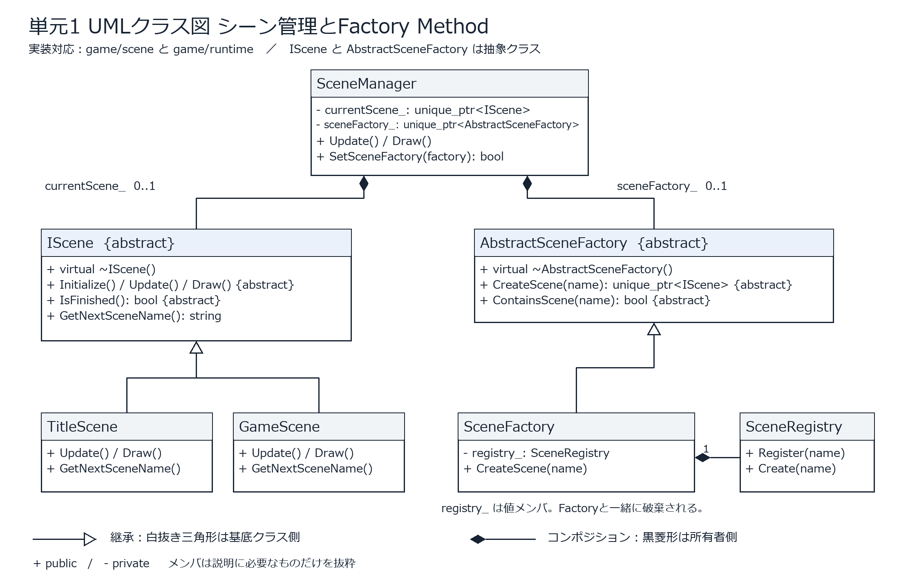

# ソースレビュー単元1 判定と修正報告

2026年10月2日に、提示された「ソースレビュー単元1」の課題スライドの文字情報と、このリポジトリの自作C++コードを照合しました。対象は01_01から01_05です。外部ライブラリの実装は作者の設計実績に数えていません。

**修正前は、そのまま問題なしとは判定できませんでした。カプセル化の抜け、衝突判定の基底クラスの仮想デストラクタ不足、実行されない旧Stateコード、UML画像の不足を修正しました。修正後は各項目の基本的な成立条件を満たす実装と提出物を確認できています。**

実際の採点プロンプトと点数配分は提示されていないため、以下はスライドの条件に基づく判定です。「適用できる全箇所」という条件には設計判断が含まれるので、データ方式を採用した箇所の説明も掲載しています。

## 項目別の判定

| 項目 | 修正前の懸念 | 修正後の判定と根拠 |
| --- | --- | --- |
| 1-1 カプセル化 | 描画・カメラ・軌跡設定などのgetterが書き換え可能な参照を返す。敵HPに負数を設定できる | 主要な漏れを修正。読み取りはconst参照または値、書き換えは専用メソッドを経由する |
| 1-2 ポリモーフィズム | シーン・Collider派生クラスは利用されているが、Colliderに仮想デストラクタがない | 基本条件を満たす。virtual、override、基底型からの呼び出し、仮想デストラクタを確認 |
| 1-3 State Pattern | 敵の行動はenum分岐中心。旧Stateクラスはビルド対象外で、現行Enemyに存在しないAPIを呼ぶ | 実際に使用する敵・ボス・ドローンの制御をStateクラスへ変更。各Stateが次状態を決定する |
| 1-4 デザインパターン | 実装済みのパターンの根拠を見つけにくい | Factory MethodとDirty Flagを確認。State・Singleton以外の実装として提示できる |
| 1-5 UMLクラス図 | 指定形式の提出用画像がない | PNGを2枚作成。継承とコンポジションの専用記号と向きを確認 |

## 01 01 カプセル化

`Object3d`、`Sprite`、`Camera`、`DebugCamera`、`Model`、`SkinnedModel`、`Enemy`の内部データを返すgetterを読み取り専用にしました。`LogWrite`の出力ストリームも、外部から直接閉じたり書き換えたりできる参照を返さない形にしています。

ImGuiで位置・色・サイズを編集する箇所は、一旦値をコピーして編集し、変更をsetterへ渡します。これにより、`Object3d::SetColor()`が設定する色の上書きフラグなども、正規の更新経路で変更されます。

`BulletManager::GetTrailSettings()`もconst参照に変更し、`SetTrailSettings()`を追加しました。寿命、点数、補間数、幅、減衰曲線、発光量、透明度を既存編集UIの範囲に制限し、非有限の数値には初期値を使います。JSON読込・制作UI・遠征の初期設定をこの更新経路へ変更しました。

`ExpEnemy::SetHp()`は出現時のHP設定用で、HPと最大HPを1以上にそろえます。ダメージ・死亡は既存のダメージ処理が担当します。`Collider`の半径設定は負数・NaN・無限大を拒否します。

`DroneMission`はクラスに変更して、状態・時間・爆発種別・命中フラグをprivateにしました。命中フラグは`ConsumeImpact()`で消費します。

設定値、座標、イベント結果などの`struct`は値として扱うデータ表現です。publicなデータ構造があるだけでカプセル化違反と判断するのではなく、そのデータがオブジェクトの内部状態を外から無制限に変えられるかを確認してください。所有コンテナ自体を返さず、操作用ポインタの一覧を値で返すAPIもあります。対象オブジェクトへの操作はその公開メソッドを経由します。

主な確認先は[BulletManager](../../project/game/player/actor/BulletManager.h)、[Object3d](../../project/DirectX/engine/3d/Object3d.h)、[Sprite](../../project/DirectX/engine/2d/Sprite.h)、[DroneMission](../../project/game/player/TankSpecialCombat.h)です。

## 01 02 ポリモーフィズム

実行経路を含めて、次の組み合わせを確認しました。

| 基底型 | 派生型 | 基底型を介して呼ぶ箇所 |
| --- | --- | --- |
| `IScene` | `TitleScene`、`GameScene` | `SceneManager`が`unique_ptr<IScene>`からUpdate・Draw・終了判定を呼ぶ |
| `AbstractSceneFactory` | `SceneFactory` | `SceneManager`が抽象工場からシーンを生成する |
| `Collider` | `Player`、`Enemy`、`ExpEnemy`、`Bullet`など | `CollisionManager`が`Collider*`から衝突応答を呼ぶ |
| 各戦闘Contextの`State` | 状態ごとの派生クラス | `const State&`からUpdateを呼ぶ |
| `IGameModule` | `BuiltInGameModule` | 起動処理が基底型からシーン登録を呼ぶ |

`Collider`に`virtual ~Collider() = default`を追加しました。基底型の`unique_ptr`経由で破棄した際に、派生デストラクタも実行されることを回帰テストで確認しています。

主な確認先は[IScene](../../project/game/scene/IScene.h)、[SceneManager](../../project/game/scene/SceneManager.cpp)、[Collider](../../project/game/collision/Collider.h)、[CollisionManager](../../project/game/collision/CollisionManager.cpp)です。

## 01 03 State Pattern

次の5箇所を、共通の仮想Updateを持つStateクラスによる実装に変更しました。

| 状態を持つクラス | 状態クラス | 実際の利用先 |
| --- | --- | --- |
| `ExpEnemyCombatCycle` | Cooldown、Tracking、Locked、Active、Recovery | 突進敵 |
| `ExpEnemyMagazineCycle` | Cooldown、Tracking、Locked、Active、Recovery | 射撃敵の有限弾倉・リロード |
| `expguard::BladeCycle` | Cooldown、Locked、Active、Recovery | 近接敵の予備動作・攻撃・後隙 |
| `RivalBossCombat` | Reposition、Tracking、Locked、Volley、DashWarning、Dash、Reload | 遠征ボス |
| `tankspecial::DroneMission` | Escort、Warning、Charging、Returning、Rebuilding | プレイヤーのドローン |

`ExpEnemyCombatCycle::Advance()`の呼び出しは次の形です。

```cpp
const State& state = GetState(phase_);
return state.Update(*this, deltaTime, canTrackTarget);
```

状態ごとの派生クラスがUpdateをoverrideし、内部の遷移メソッドを呼んで次状態を決めます。Stateクラスをprivateな入れ子クラスにしているため、外部へ内部変数を公開したりfriendを追加したりする必要はありません。

各Stateのオブジェクトは変更しない共通オブジェクトです。敵ごとの時間・残弾・状態はContextに持たせ、状態切り替えごとのヒープ確保を避けています。別の敵やコピーしたContextの時間が干渉しないことも検証しました。単元1の時点ではGetStateのswitchで具体的な状態オブジェクトを選んでいました。[単元2の修正](../source-review-unit2/README.md)では、この選択を配列に変更しています。行動と遷移の処理は派生クラスにあります。

シーン制御も`IScene`の多態呼び出しと、各シーンの`GetNextSceneName()`による次シーンの選択を備えています。

旧`project/game/enemy/state/`の14ファイルは、プロジェクトのコンパイル項目に含まれず、外部参照もありませんでした。`KamataEngine`や現行Enemyに存在しないAPIを呼ぶため、現行State実装の証拠にはできません。`generated/source-review-legacy-state/`に原本をバックアップしたうえで、提出ソースから除去し、不要なインクルード検索パスも整理しました。Git履歴からも復元できます。

確認先は[突進敵](../../project/game/exp/ExpEnemyCombatCycle.h)、[射撃敵](../../project/game/exp/ExpEnemyMagazineCycle.h)、[近接敵](../../project/game/exp/ExpGuardCombat.h)、[ボス](../../project/game/enemy/actor/RivalBossCombat.h)、[ドローン](../../project/game/player/TankSpecialCombat.h)です。

## 継承やStateへ一律に変更していない箇所の理由

スライドは、他の方法を採用する理由を明確に説明できる場合を認めています。次の箇所は、その説明とともに確認する必要があります。これらまで例外として認めるかは採点側の判断です。

| 箇所 | 現在の方式と理由 |
| --- | --- |
| 強化カード・敵種・武器パラメータ | JSONや値データで数値・候補・条件を共有する。差が数値や構成だけの項目を派生クラスに分けると、実プレイ・プレビュー・制作ツールで同じ定義を扱いにくい |
| `GuidedCombatTutorial` | 実際の撃破・通貨回収・ダッシュ完了を記録するイベント中心の進行。状態ごとに異なる毎フレーム行動を持たず、条件・カウンタを小さなクラスにまとめている |
| 遠征Director・作戦マップ | 部屋・選択結果・通貨・経路を扱う進行データ。部屋や報酬は共通定義から読み込む。戦闘中の振る舞いは別の敵State・シーンに委譲する |
| `PrototypeBossCombat`・`PulseCycle`・演出Transition | 3状態以下または単発の時間進行。スライドの「単純な状態・一時的な状態変更」に該当すると判断した |
| ボタンの表示状態 | 色・大きさ・入力可否を選ぶ表示データ。ゲームの行動Stateとは責務が異なる |
| 座標・行列・描画のループ・計算ヘルパー | 値計算や大量データを処理する。関数・template・値型の構成を使い、各要素への仮想呼び出しを必須にしない |

`Player`と`GameScene`は依然として大きく、責務の分割には改善余地があります。今回の修正だけで、全設計判断が最適になったとまでは評価していません。

## 01 04 StateとSingleton以外のデザインパターン

| パターン | 実装と採用理由 |
| --- | --- |
| Factory Method | `AbstractSceneFactory::CreateScene()`を`SceneFactory`がoverrideする。`SceneManager`は具体的なシーン型を知らずに生成・切り替えできる。`SceneRegistry`へ生成関数を登録する方式と組み合わせている |
| Dirty Flag | `TrailManager::NeedsGeometryRebuild()`が`geometryDirty_`と各軌跡の更新番号を比較する。変化がない場合に軌跡頂点を作り直さない。変更・消去・再利用・時間経過を既存テストで検証した |
| イベント通知 | `ExpEnemy`の撃破コールバックからシーンに結果を通知する。敵がUIや遠征の実装を直接呼ばないための単一通知先の仕組み。多重購読を持つ一般的なObserverと同一のAPIではない |

Factory MethodとDirty Flagは、State・Singletonを実績から除外しても残ります。弾は現在`make_unique`で生成しているため、弾管理をObject Poolとして説明することは避けてください。

確認先は[SceneFactory](../../project/game/scene/SceneFactory.cpp)、[SceneRegistry](../../project/game/runtime/SceneRegistry.cpp)、[TrailManager](../../project/DirectX/engine/commom/TrailManager.cpp)です。

## 01 05 提出用UML画像

提出条件の`.png`形式で2枚作成しました。まずシーン管理とFactoryの図を提出すると、1-2・1-4の実装との対応を説明できます。

- [シーン管理とFactory Method](01-05-scene-factory.png)
- [敵のStateパターン](01-05-enemy-state.png)



継承の白抜き三角形は基底クラス側、コンポジションの黒菱形は所有者側です。`SceneManager`の`unique_ptr`、`SceneFactory`の値メンバ`registry_`、`ExpEnemy`の値メンバ`combatCycle_`という実際の所有関係を反映しています。敵Contextから共有Stateへの呼び出しは依存として表し、ContextがStateを独占所有する図にはしていません。

画像は[生成スクリプト](../../project/tools/render_source_review_uml.py)から再生成できます。PillowとWindowsのMeiryoを使用します。

## 検証結果

修正後のソースで実行した検証結果です。DevelopmentとReleaseは、それぞれVisual Studio 2026のMSVC v145でビルドしました。

| 検証 | 結果 |
| --- | --- |
| 敵AIと実際の敵メソッドの統合テスト | 成功。状態遷移、遮蔽、照準固定、リロード、召喚、反射、Context間の独立性 |
| ボス戦闘テスト | 成功。照準固定、残弾、リロード、第二段階、ダッシュ、長いフレーム |
| 追加能力テスト | 成功。ドローンの命中・帰還・再生成、EMPなど |
| 衝突テスト | 成功。報酬、弾の所有者、後片付け。新しい軌跡設定setterの異常値・通常値も検証 |
| 軌跡テスト | 成功。頂点生成、変更検出、再利用、容量制限 |
| チュートリアルテスト | 成功。イベントの記録、進行条件、完了、スキップ |
| TankRun関連テスト3種 | 成功。進行・資源・強化・ボスのタイミング |
| 強化カードプレビューテスト | 成功。1,032,192サンプルと15種類の特殊能力 |
| Development x64とRelease x64 | 両方成功。Releaseは`CG2DeveloperTools=false`を指定 |
| Developmentの実行ファイルでタイトルデモを検証 | 成功。デモ4段階、453回の発射サンプル、37撃破、31ダッシュ、画面フェード、新しい遠征への遷移を確認 |
| UML画像 | 作成後に表示して文字・線・記号の向きを確認済み |

単体テストには描画を置き換えた検証も含まれます。採点条件との照合と、手動プレイでの操作感・難易度の評価は別です。

ビルドログは`generated/source-review-development-build.log`と`generated/source-review-release-build.log`、実行確認結果は`project/generated/title_demo/validation.json`にあります。`test_title_demo.ps1 -Configuration Development`で実行しました。今回はReleaseの手動プレイ全体を確認したという結果ではありません。

## 提出に含めるもの

現在の自作ソースと`project/CG2.sln`、少なくとも`01-05-scene-factory.png`を含めてください。この報告書は実装場所と例外理由を説明する補足として使えます。`generated/`のバックアップ・テスト出力・古い実行ファイルは提出コードの根拠に数えないでください。
